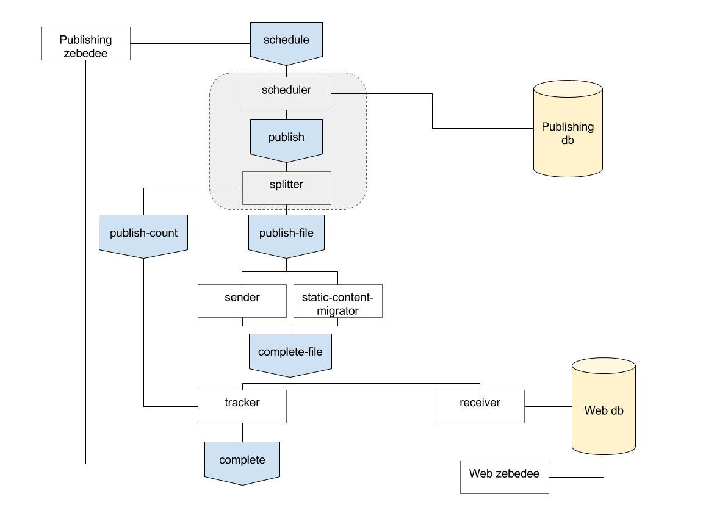

dp-publish-pipeline
================

### Getting started
See the following pages per service
* [Publish-scheduler](publish-scheduler/README.md)
* [Publish-tracker](publish-tracker/README.md)
* [Publish-metadata](publish-metadata/README.md)
* [Publish-data](publish-data/README.md)
* [Publish-receiver](publish-receiver/README.md)
* [Publish-search-indexer](Publish-search-indexer/README.md)

### API
* [Content-API](content-api/README.md)
* [Generator-API](generator-api/README.md)

### Design

### Event messages
See [Event Message](doc/Messages.md) for details on each topic and type of message sent

### Latest test results (2017 February)
Machines: AWS M4.large, M3.xlarge, M4.large

#### AWS setup
* M4.large : Kafka + postgres (For publish-scheduler)
* M4.large : 32 publish-data + 32 publish-metadata
* M3.xlarge : publish-receiver + postgres/mongodb

#### Results
| File count | Size   |  Time in Seconds   |
|------------|--------|--------------------|
| 16k         | 780MB  |  21 - 22          |

### Test results for publishing (2016 December results)
Machine: AWS M4.Large instance 2VCPU and 8GB Memory

| File count | Size   |  Time in Seconds   |  IO mbs  | Network mbps |
|------------|--------|--------------------|----------|--------------|
| 8k         | 256MB  |  27                |  23      |  452         |
| 16K        | 512MB  |  64                |  26      |  436         |

#### Notes
* Ran on a single AWS instance, all 5 services plus docker, mongo, kafka and zookeeper were ran.
* The biggest bottle neck during the tests was the mongod process, as it was using 70% / 90% of the CPU.
* Read / Writes During monitoring no disk I/O bottle necks were seen
* Network max usage 436 mbp out of 450 mbps. This only lasted for a second.
* Both CPUs were at 100% utilisation when publishing the collection.
* Ram usage was low 2-3 GB (Including cache)

### Contributing

See [CONTRIBUTING](CONTRIBUTING.md) for details.

### License

Copyright ©‎ 2016, Office for National Statistics (https://www.ons.gov.uk)

Released under MIT license, see [LICENSE](LICENSE.md) for details.
